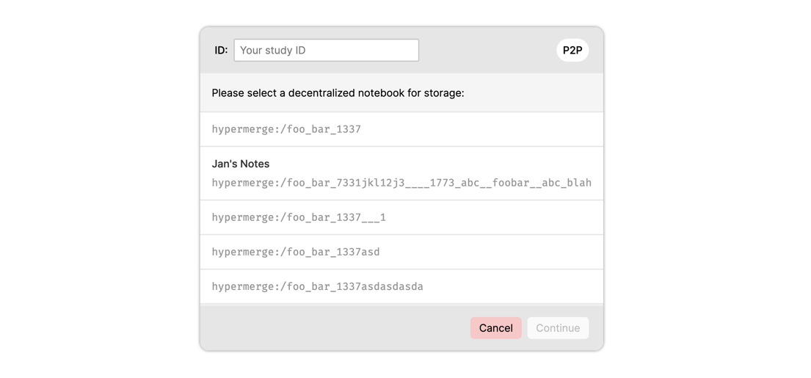

# Recogito P2P Annotation Discovery

An annotation discovery modal dialog developed for usage on a [fork of Recogito](https://github.com/falafeljan/recogito2-p2p) that [uses P2P annotation](https://github.com/falafeljan/from-me-to-you). Since storage isn't centralized in P2P networks, users can select in which ‘notebook’ (i.e., decentralized network swarm) they want to store their annotations in.

While this library functions independently of Recogito or P2P Web Annotation, it's developed with our approach to P2P annotation in mind. Also, certain functionality is tailored for use in studies, especially the required user-provided ID.

## Usage

Clone the repository. You'll want to use a modern version of Node.js `>=12.0.

- `npm run dev` to spin up a local development server. See `example/` for exemplary usage.
- `npm run build` to build a library bundle.

## API

#### `discovery = createDiscovery(node, targetUrl, opts)`

Will create a new dialog instance. Is hidden by default.

- `node` DOM node to mount the React tree in.
- `targetUrl` Web Annotation target URL.
- `opts`
  - `userId` Provide an initial user ID, e.g., stored from previous sessions.
  - `useP2P` If true, will ask for P2P storage. If false, will just ask for user ID, as centralized (default) storage is selected.
  - `allowOutsideClick` Whether or not to dismiss the modal by clicking outside the frame.

#### `discovery.open()`

Show the modal.

#### `discovery.close()`

Close the modal.

#### `discovery.setDocuments(docs)`

Will provide the discovery dialog with a set of documents. The items of `docs` may either be document URLs (strings), or objects (`{ title: 'foo', url: 'bar' }`). See `example/index.js`.

#### `discovery.on('save', id, [docUrl])`

Emitted if the user successfully provided an ID. If `useP2P`, selection of a notebook (i.e., document URL) is required.

#### `discovery.on('cancel')`

Emitted if the user canceled the dialog, either by clicking ‘Cancel’ or dismissing via clicking outside the dialog (if `allowOutsideClick`).

## License

[MIT License](/LICENSE), see `./LICENSE`.
